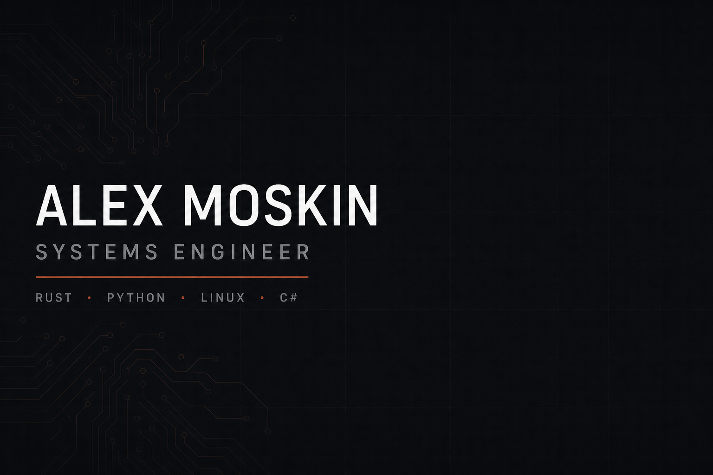

# Alex Moskin

Systems engineer. Networking software, embedded hardware, applied BCI research.

Currently working on my own protocol — async I/O, zero-copy parsing, C# client.

**Remote / worldwide.** Open to full-time roles and freelance contracts.

[LinkedIn](https://www.linkedin.com/in/alex-moskin-970339434) · friedalex120@gmail.com

## Stack

| | |
|---|---|
| Languages | Rust, Python, C#, C |
| Systems | Linux, OpenWrt, ESP32 |
| Domains | networking, embedded audio, EEG / BCI |

## Featured projects

- **Himera** — L3 DPI-resistant VPN: [client](https://github.com/spamulodd/Himera-client) · [core](https://github.com/spamulodd/Himera-core) · [panel](https://github.com/spamulodd/Himera-panel) · [bot](https://github.com/spamulodd/Himera-bot) · [agent](https://github.com/spamulodd/Himera-agent) · [ops](https://github.com/spamulodd/Himera-ops). Production hardening in progress.

## Public work

- **[fulldive-vision](https://github.com/spamulodd/fulldive-vision)** — EEG → image retrieval (Python / PyTorch)
- **[conflux-engine](https://github.com/spamulodd/conflux-engine)** — Rust subscription fetch / parse / normalize engine, IPC daemon for desktop clients
- **[skvoz](https://github.com/spamulodd/skvoz)** — OpenWrt policy routing: direct, filtered, and tunneled paths
- **[portable-audio](https://github.com/spamulodd/portable-audio)** — DIY portable speaker: ESP32, I2S DAC, TPA3116D2, enclosure drawings

## Notes

English — B1 (technical reading; limited speaking). Russian — native.
